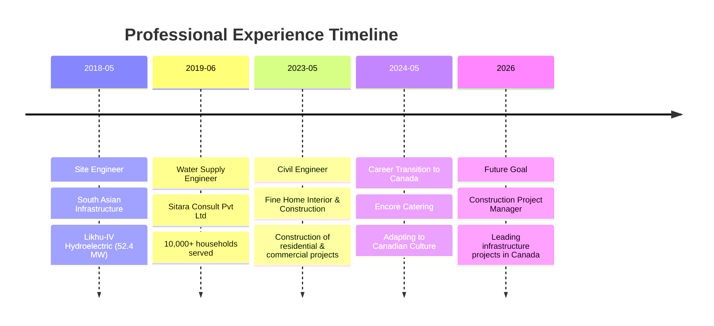

#  Hi, I'm Sangam Bhatta

<div align="center">
  
</div>

<div align="center">
  
  [](https://www.linkedin.com/in/bhattasangam)
  [](mailto:sangambhatta12@gmail.com)
  [](tel:+14379559450)
  [](https://maps.google.com/?q=Toronto,ON)
  
</div>

---

## 🏗️ About Me

> *"Building sustainable infrastructure that transforms communities and improves lives"*

I'm a dedicated **Civil Engineer** with 5+ years of international experience in infrastructure development, currently pursuing **Construction Project Management** at Lambton College in Toronto. My career journey has taken me from managing large-scale water supply projects in Nepal to contributing to hydroelectric power generation, and now bringing my expertise to the Canadian construction industry.

### 🌟 What Defines Me

```
📊 Data-Driven Decision Maker | 🤝 Collaborative Leader | 🎯 Results-Oriented Professional
🌱 Sustainability Champion | 🛡️ Safety Advocate | 💡 Innovation Enthusiast
```

### 💼 Professional Snapshot

- **🏆 Track Record:** Successfully delivered projects impacting 60,000+ lives
- **📈 Project Value:** Managed infrastructure projects worth $10M+ collectively
- **👥 Leadership:** Directed teams of 30+ professionals in complex construction environments
- **🎯 Efficiency:** Achieved significant reduction in project timelines through optimized workflows
- **✅ Safety Excellence:** Maintained zero-incident record across all projects
- **🌍 Sustainable Impact:** Integrated environmental considerations in all projects

---

## 📊 Professional Impact Dashboard

<div align="center">

| 🏅 **Metric** | 📈 **Achievement** | 🎯 **Impact** |
|:-------------:|:------------------:|:-------------:|
| **People Served** | 60,000+ | Clean water access for communities |
| **Households Connected** | 10,122 | Improved quality of life |
| **Pipeline Network** | 270+ KM | Extensive distribution coverage |
| **Storage Capacity** | 2,000+ m³ | Reliable water supply |
| **Power Infrastructure** | 52.4 MW | Clean energy generation |
| **Team Leadership** | 30+ members | Skilled workforce development |
| **Safety Record** | 0 incidents | Exemplary HSE standards |
| **Cost Optimization** | 15-20% | Efficient resource utilization |
| **Project Delivery** | 100% on-time | Reliable execution |

</div>

---

## 🛠️ Technical Arsenal

### 💻 Software Proficiency

<div align="center">

#### Design & Engineering


#### Project Management


</div>

### 🔧 Core Competencies Matrix

<table align="center">
<tr>
<td width="50%">

**🎯 Project Management**
- Work Breakdown Structure (WBS)
- Cost Breakdown Structure (CBS)
- Critical Path Method (CPM)
- Earned Value Management (EVM)
- Risk Assessment & Mitigation
- Procurement & Contract Management

</td>
<td width="50%">

**📐 Technical Design**
- Hydraulic Network Analysis
- Structural Design & Detailing
- Geotechnical Investigation
- Quantity Surveying & BOQ
- As-Built Documentation
- Quality Control & Assurance

</td>
</tr>
<tr>
<td width="50%">

**👥 Leadership & Communication**
- Stakeholder Management
- Team Coordination
- Conflict Resolution
- Report Writing & Documentation
- Client Presentations
- Cross-Cultural Collaboration

</td>
<td width="50%">

**🌱 Sustainability & Compliance**
- Environmental Impact Assessment
- Safety Management Systems
- Regulatory Compliance
- Sustainable Design Practices
- Community Engagement
- Social Impact Evaluation

</td>
</tr>
</table>

---

## 🎓 Education & Professional Development

### 📚 Academic Credentials

<details>
<summary><b>🏗️ Construction Project Management (Current)</b></summary>

**Institution:** Lambton College, North York, ON  
**Duration:** May 2024 – December 2025 (Excepted) 
**Status:** Currently Pursuing

#### 📖 Comprehensive Coursework:
- **Technical:** Construction Methods & Materials, Advanced Blueprint Reading, Structural Systems
- **Management:** Project Management, Risk & Procurement Management, Resource & Schedule Management
- **Financial:** Construction Economics, Cost Control, Financial Analysis
- **Legal:** Construction Contracts & Laws, Building Codes & Regulations
- **Safety:** Construction Safety Management, Jobsite Management
- **Communication:** Professional Communications, Stakeholder Management

</details>

<details>
<summary><b>🎓 Bachelor of Civil Engineering</b></summary>

**Institution:** Tribhuvan University, Nepal  
**Graduation:** 2018  
**Focus:** Structural Engineering & Construction Management

#### 📖 Key Subjects:
- Reinforced Cement Concrete (RCC) Design
- Steel Structure Design & Analysis
- Seismic Analysis & Applied Dynamics
- Construction Management & Planning
- Geotechnical Engineering
- Estimation & Costing
- Surveying & Transportation Engineering

</details>

### 🏅 Certifications & Licenses

| Certification | Issuing Authority | Year | Status |
|:-------------|:-----------------|:-----|:-------|
| **Civil Engineer License (A Class)** | Nepal Engineering Council | 2018 | Active |
| **Ontario Driver's License** | Ontario Ministry of Transportation | 2024 | Valid |

---

## 💼 Professional Journey

### 🗓️ Career Timeline



```markdown
# 💼 Professional Experience

## 🇨🇦 Cleaner | Encore Catering, Toronto, ON
`May 2024 - December 2024`

- 🎯 **Adaptability & Reliability**: Demonstrated exceptional adaptability, punctuality, and reliability in a dynamic catering environment
- 🤝 **Team Collaboration**: Supported colleagues with daily targets under tight deadlines using effective problem-solving
- ✅ **Professional Standards**: Upheld Canadian professional standards while transitioning to the Canadian work environment

---

## 🏗️ Civil Engineer | Fine Home Interior & Construction, Nepal
`May 2023 – April 2024`

### 📐 Technical Design & Documentation
- Executed precise structural and as-built drawings using **AutoCAD**
- Enhanced field coordination through robust technical documentation

### 💰 Cost Management
- Conducted comprehensive quantity takeoffs and cost estimates
- Successfully aligned budgets with project scopes

### 👷 Site Management
- Coordinated sub-trade activities and performed meticulous site inspections
- Achieved **20% reduction in workplace incidents**

### 📊 Project Controls
- Facilitated project schedule updates using **MS Project**
- Achieved notable reduction in project timeline through optimization

---

## 💧 Water Supply - Civil Engineer | Sitara Consult Pvt Ltd, Nepal
`June 2019 – April 2023`

### 🎯 Impact Summary

📊 10,000+ households served | 🚰 270 KM pipeline network | 👥 Multi-disciplinary team coordination


### Key Achievements:
- Project Leadership: Spearheaded engineering design for co-financed water supply projects
- Technical Excellence: Produced comprehensive construction drawings, BOQs, and specifications
- Project Management: Developed WBS/CBS for seamless planning and resource allocation
- Procurement: Prepared RFIs, RFQs, and RFPs to streamline vendor selection
- Field Operations**: Executed site inspections and topographic surveys using a total station
- Technology Integration**: Leveraged GIS software for site mapping and geotechnical analysis

---

## ⚡ Site Engineer | South Asian Infrastructure Pvt Ltd, Nepal
`May 2018 – June 2019`

### Project: Likhu-IV Hydroelectric Project (52.4 MW)

```mermaid
graph LR
    A[30-Member Crew] --> B[Underground Excavation]
    B --> C[Rock Support]
    C --> D[Slope Stabilization]
    D --> E[Zero Incidents]

### Responsibilities:
- **Team Leadership**: Managed a 30-member crew per shift for tunnel construction
- **Technical Work**: Created Bar Bending Schedules (BBS) using AutoCAD and Excel
- **Project Controls**: Monitored schedules using MS Project and tracked milestones
- **Cost Management**: Executed quantity take-offs and progress billing
- **Safety Excellence**: Maintained **zero-incident safety record**
- **🏆 Achievement**: Achieved early delivery of HRT construction milestone

---

## 🤝 Volunteer Experience

### Paragon Engineering Consultancy | `November 2017`
- 🏗️ Organized logistics for Earthquake-Resistant Construction training
- 📚 Contributed to community resilience building

### Picasso Consultant Pvt Ltd | `February 2017`
- 🚦 Executed traffic survey for Municipal Transport Master Plan
- 📊 Supported urban planning through data collection
